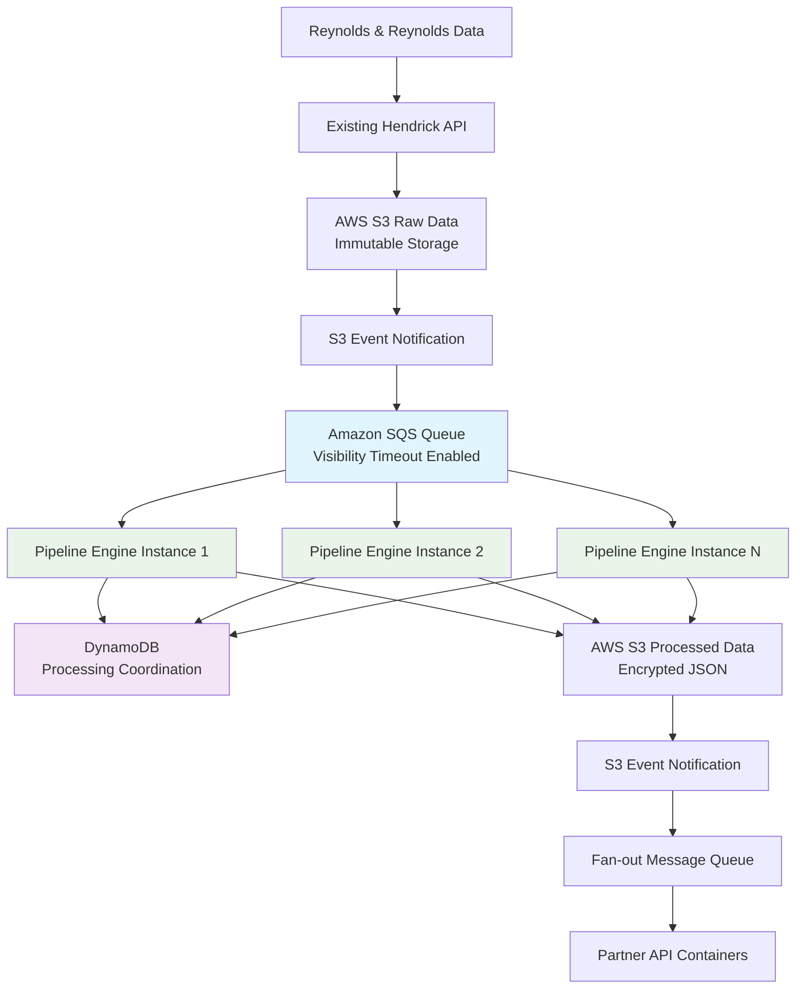
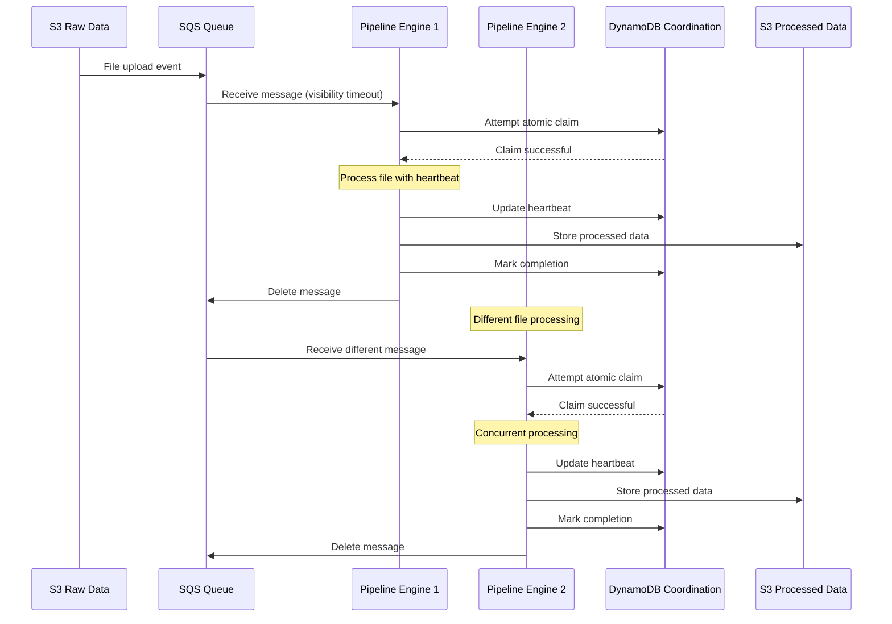

# Hendrick Pipeline Engine - Scaling Architecture

## Executive Summary

The Hendrick Pipeline Engine currently operates as a single-instance transformation service that processes Reynolds & Reynolds data files between immutable S3 storage and partner API stacks. While this design successfully handles the current data volume, scaling to accommodate increased file throughput from Reynolds & Reynolds requires addressing fundamental race condition risks and implementing distributed processing capabilities.

**Current Limitations:**
- Single pipeline engine instance creates processing bottleneck
- No race condition prevention for concurrent file processing
- Direct S3 event notifications lack coordination mechanisms
- No distributed locking or atomic operations for file claims
- Limited horizontal scaling capabilities

**Scaling Objectives:**
- Support multiple pipeline engine instances for increased throughput
- Eliminate race conditions when processing the same immutable files
- Implement reliable message delivery and processing coordination
- Enable auto-scaling based on file processing demand
- Maintain data integrity and processing reliability

## Current Architecture Analysis

### Existing Data Flow
```
Reynolds & Reynolds → Existing Hendrick API → AWS S3 Raw Data (immutable)
                                                      ↓
                                            S3 Event Notification
                                                      ↓
                                         Single Pipeline Engine Instance
                                                      ↓
                                    Process XML/CSD + Apply KMS Encryption
                                                      ↓
                                        AWS S3 Processed Data Bucket
                                                      ↓
                                            S3 Event Notification
                                                      ↓
                                            Fan-out Message Queue
                                                      ↓
                                            Partner API Containers
```

### Race Condition Risks

**File Processing Conflicts:**
- Multiple pipeline instances could receive the same S3 event notification
- No mechanism to prevent duplicate processing of the same file
- Potential data corruption from concurrent transformation operations
- No atomic "claim" operations for file processing

**Resource Contention:**
- Shared S3 bucket access without coordination
- KMS encryption operations without process isolation
- Potential deadlocks in multi-step processing operations

**State Management Issues:**
- No centralized processing state tracking
- No detection of failed or stale processing operations
- Limited retry mechanisms for failed transformations

## Scaling Solutions

### 1. Message Queue-Based Coordination

**Amazon SQS Implementation:**
```
S3 Event → SQS Queue → Pipeline Engine Instances (Auto-scaling)
```

**Key Features:**
- **Visibility Timeout**: Ensures only one consumer processes each message
- **Dead Letter Queue**: Handles failed processing attempts
- **FIFO Queue Option**: Maintains processing order if required
- **Message Deduplication**: Prevents duplicate processing

**Benefits:**
- Reliable message delivery with at-least-once semantics
- Natural load balancing across multiple pipeline instances
- Built-in retry mechanisms with exponential backoff
- CloudWatch integration for monitoring and alerting

### 2. Distributed Processing Coordination

**DynamoDB Coordination Table:**
```
ProcessingCoordination Table:
- file_path (Primary Key)
- processing_status (pending, processing, completed, failed)
- processor_id (unique identifier for pipeline instance)
- claim_timestamp (when processing was claimed)
- heartbeat_timestamp (last activity from processor)
- completion_timestamp (when processing finished)
- ttl (automatic cleanup of old records)
```

**Atomic Operations:**
- **Claim File**: Conditional write to set processing status
- **Heartbeat Update**: Regular timestamp updates during processing
- **Release Claim**: Mark completion and cleanup
- **Stale Process Detection**: Identify and reclaim expired processes

### 3. Idempotent Processing Design

**Content-Based Processing IDs:**
- Generate unique processing ID from file content hash
- Enable safe retry of failed operations
- Detect and skip duplicate processing attempts
- Maintain processing audit trail

**Atomic Multi-Step Operations:**
- Break complex transformations into atomic steps
- Implement rollback mechanisms for failed operations
- Use S3 versioning for intermediate processing states
- Maintain transaction logs for debugging

### 4. Auto-Scaling Implementation

**Scaling Metrics:**
- SQS queue depth (primary scaling trigger)
- Average processing time per file
- Error rate and retry frequency
- Resource utilization (CPU, memory, network)

**Scaling Policies:**
- **Scale Out**: Add instances when queue depth exceeds threshold
- **Scale In**: Remove instances during low activity periods
- **Predictive Scaling**: Based on historical patterns
- **Emergency Scaling**: Rapid scale-out for high-priority files

## Proposed Architecture

### Multi-Instance Pipeline Engine Design



### Processing Flow with Race Condition Prevention



## Implementation Phases

### Phase 1: Message Queue Foundation (Weeks 1-2)

**Objectives:**
- Replace direct S3 event notifications with SQS
- Implement basic message processing in pipeline engine
- Add dead letter queue for failed processing

**Tasks:**
1. Create SQS queue with appropriate configuration
2. Modify S3 bucket to send events to SQS instead of direct notification
3. Update pipeline engine to consume from SQS
4. Implement message acknowledgment and error handling
5. Add CloudWatch monitoring for queue metrics

**Success Criteria:**
- All file processing goes through SQS
- No duplicate processing of the same file
- Failed messages move to dead letter queue
- Monitoring dashboard shows queue health

### Phase 2: Coordination Database (Weeks 3-4)

**Objectives:**
- Implement DynamoDB coordination table
- Add atomic claim/release operations
- Enable heartbeat monitoring

**Tasks:**
1. Create DynamoDB table with appropriate schema
2. Implement atomic file claiming logic
3. Add heartbeat mechanism during processing
4. Create cleanup process for stale claims
5. Add monitoring for coordination table metrics

**Success Criteria:**
- Multiple pipeline instances can run without conflicts
- Stale processes are automatically detected and reclaimed
- All file processing is tracked in coordination table
- Heartbeat mechanism prevents lost processing

### Phase 3: Multi-Instance Deployment (Weeks 5-6)

**Objectives:**
- Deploy multiple pipeline engine instances
- Implement auto-scaling based on queue depth
- Validate race condition prevention

**Tasks:**
1. Containerize pipeline engine for horizontal scaling
2. Implement auto-scaling policies
3. Deploy multiple instances in different availability zones
4. Load test with high file volume
5. Validate no race conditions or duplicate processing

**Success Criteria:**
- Multiple instances process files concurrently
- Auto-scaling responds to queue depth changes
- No data corruption or duplicate processing
- Performance meets throughput requirements

### Phase 4: Advanced Features (Weeks 7-8)

**Objectives:**
- Add idempotent processing capabilities
- Implement advanced monitoring and alerting
- Optimize performance and resource usage

**Tasks:**
1. Implement content-based processing IDs
2. Add comprehensive monitoring dashboard
3. Implement predictive scaling algorithms
4. Add processing analytics and reporting
5. Optimize resource utilization

**Success Criteria:**
- Idempotent processing prevents data inconsistencies
- Comprehensive monitoring provides operational visibility
- Predictive scaling reduces latency spikes
- Resource utilization is optimized

## Performance Considerations

### Throughput Targets

**Current State:**
- Single pipeline engine instance
- Processing time varies by file size and complexity
- No concurrent processing capability

**Scaled State Targets:**
- **File Processing Rate**: 10x increase in concurrent file processing
- **Average Processing Time**: < 30 seconds per file
- **Queue Depth**: Maintain < 10 messages during normal operation
- **Error Rate**: < 1% of processed files
- **Availability**: 99.9% pipeline engine availability

### Resource Optimization

**Compute Resources:**
- **CPU**: Right-size instances based on processing patterns
- **Memory**: Optimize for file size and transformation complexity
- **Network**: Ensure sufficient bandwidth for S3 operations
- **Storage**: Minimal local storage requirements

**Cost Optimization:**
- **Spot Instances**: Use for non-critical pipeline instances
- **Reserved Instances**: For baseline processing capacity
- **Auto-scaling**: Minimize idle resources during low activity
- **S3 Request Optimization**: Batch operations where possible

## Monitoring and Alerting

### Operational Visibility Requirements

**Real-Time Queue Monitoring:**
- Live queue depth visualization with historical trends
- Message age distribution and oldest message alerts
- Processing velocity (messages/minute) with capacity planning
- Queue health status dashboard with color-coded indicators

**Work-in-Progress Tracking:**
- Active file processing status with estimated completion times
- Pipeline engine instance workload distribution
- Processing step visibility (claim → transform → encrypt → store)
- Stuck or stale processing detection with automatic alerts

**Business Intelligence Dashboards:**
- Daily/weekly/monthly processing volume trends
- File type distribution (XML vs CSD) processing patterns
- Peak processing times and capacity utilization
- Partner-specific processing metrics and SLA compliance

### Comprehensive Monitoring Architecture

**CloudWatch Dashboards:**
```
Pipeline Engine Operations Dashboard:
├── Queue Health Panel
│   ├── SQS Message Count (visible/in-flight/delayed)
│   ├── Dead Letter Queue Depth
│   ├── Average Message Age
│   └── Message Velocity Trends
├── Processing Status Panel
│   ├── Active Pipeline Instances
│   ├── Files Being Processed (real-time)
│   ├── Processing Success Rate
│   └── Average Processing Time
├── Resource Utilization Panel
│   ├── CPU/Memory Usage per Instance
│   ├── Network I/O for S3 Operations
│   ├── DynamoDB Coordination Table Metrics
│   └── Auto-scaling Events
└── Business Metrics Panel
    ├── Files Processed Today/Week/Month
    ├── Processing Volume by File Type
    ├── Partner Data Distribution
    └── SLA Compliance Metrics
```

**Custom Metrics Collection:**
- **Queue Depth by Hour**: Track processing patterns for capacity planning
- **Processing Duration by File Size**: Optimize resource allocation
- **Error Classification**: Categorize failures for targeted improvements
- **Throughput Efficiency**: Messages processed per compute dollar spent

### Key Metrics

**Queue Metrics:**
- **Messages in Queue**: Total visible, in-flight, and delayed messages
- **Queue Depth Trends**: Historical patterns for capacity planning
- **Message Age Distribution**: Oldest, average, and 95th percentile message age
- **Processing Velocity**: Messages processed per minute with trend analysis
- **Dead Letter Queue Growth**: Rate of failed message accumulation
- **Queue Drain Rate**: Time to process current queue depth

**Processing Metrics:**
- **Files Processed**: Count by hour/day with success/failure breakdown
- **Processing Duration**: Average, median, and 95th percentile processing times
- **Processing Success Rate**: Success percentage with error categorization
- **Resource Utilization**: CPU, memory, network I/O per pipeline instance
- **S3 Operation Metrics**: GET/PUT request counts and latency
- **KMS Encryption Operations**: Request volume and performance

**Coordination Metrics:**
- **Active Processing Claims**: Current files being processed by instance
- **Claim Duration**: Time from claim to completion or failure
- **Stale Claim Detection**: Frequency of expired processing claims
- **Heartbeat Status**: Health of active processing instances
- **Coordination Table Performance**: DynamoDB read/write capacity and throttling
- **Atomic Operation Success**: Claim/release operation success rates

**Business Intelligence Metrics:**
- **File Type Distribution**: XML vs CSD processing volumes
- **Dealer Data Volume**: Processing by dealership for capacity planning
- **Partner Processing Load**: Data volume per partner for resource allocation
- **Processing Cost**: AWS resource costs per file processed
- **SLA Compliance**: Processing time against defined service levels

### Advanced Alerting Strategy

**Tiered Alert System:**

**Critical Alerts (Immediate Response):**
- Queue depth > 100 messages for > 5 minutes
- Processing error rate > 5% over 10-minute window
- Pipeline engine instance failures (any instance down > 2 minutes)
- Coordination table throttling or complete failures
- Dead letter queue growth > 10 messages in 5 minutes
- Processing completely stopped for > 3 minutes

**Warning Alerts (Monitor and Plan):**
- Queue depth > 50 messages for > 10 minutes
- Processing error rate > 2% over 15-minute window
- High processing latency (95th percentile > 2 minutes)
- Resource utilization > 80% on any instance for > 10 minutes
- Stale claim detection > 5 claims in 15 minutes
- Auto-scaling events (scale out/in) with resource planning recommendations

**Informational Alerts (Trend Analysis):**
- Processing volume 20% above/below historical averages
- New file types or unexpected data patterns detected
- Cost variance > 15% from projected spending
- Partner-specific processing anomalies

### Operational Monitoring Dashboard

**Real-Time Status Board:**
```
┌─────────────────────────────────────────────────────────────────┐
│                   Pipeline Engine Status                        │
├─────────────────────────────────────────────────────────────────┤
│ Queue Health:      🟢 HEALTHY        Messages: 12              │
│ Processing:        🟢 ACTIVE         Rate: 45/min              │
│ Instances:         🟢 3/3 HEALTHY    Auto-scale: STABLE        │
│ Errors:            🟢 0.3%           Last 24h: 4 failures      │
├─────────────────────────────────────────────────────────────────┤
│ Currently Processing:                                           │
│ • Instance-1: XML_PARTS_DATA_20241204_14:30.xml (2m 15s)      │
│ • Instance-2: CSD_ACME_INVENTORY_20241204_14:32.csv (45s)     │
│ • Instance-3: XML_SALES_DATA_20241204_14:31.xml (1m 30s)      │
├─────────────────────────────────────────────────────────────────┤
│ Today's Metrics:                                                │
│ • Files Processed: 1,247 (98.2% success)                      │
│ • Average Processing Time: 1m 23s                              │
│ • Peak Queue Depth: 23 messages (11:15 AM)                    │
│ • Cost: $47.32 (12% under budget)                             │
└─────────────────────────────────────────────────────────────────┘
```

### Integration with Existing Monitoring

**Unified Observability:**
- Pipeline engine metrics integrated with existing application monitoring
- Consistent alerting channels (Slack, PagerDuty, email)
- Shared dashboard themes and visualization standards
- Common log aggregation with centralized search

**Cross-System Correlation:**
- Link pipeline processing delays to partner API performance
- Correlate S3 storage metrics with processing throughput
- Track end-to-end data latency from Reynolds & Reynolds to partner APIs
- Monitor impact of pipeline scaling on downstream systems

### Monitoring Implementation Requirements

**Phase 1: Core Monitoring (Week 1)**
- Basic CloudWatch dashboard with queue and processing metrics
- Critical alerts for queue depth and processing failures
- Instance health monitoring with auto-recovery

**Phase 2: Advanced Visibility (Week 2)**
- Custom metrics collection for business intelligence
- Real-time processing status tracking
- Comprehensive alerting with escalation policies

**Phase 3: Operational Excellence (Week 3)**
- Predictive analytics for capacity planning
- Cost optimization monitoring and recommendations
- Integration with existing operational workflows

**Phase 4: Business Intelligence (Week 4)**
- Executive dashboard for business stakeholders
- Trend analysis and capacity planning reports
- SLA compliance tracking and reporting

## Operational Considerations

### Deployment Strategy

**Blue-Green Deployment:**
- Deploy new pipeline engine versions alongside existing
- Gradually shift traffic to new version
- Maintain rollback capability

**Canary Deployment:**
- Deploy to single instance first
- Monitor performance and error rates
- Gradually roll out to all instances

### Disaster Recovery

**Multi-AZ Deployment:**
- Deploy pipeline engines across multiple availability zones
- Ensure coordination table is replicated
- Implement cross-region backup for critical data

**Backup Strategy:**
- Regular snapshots of coordination table
- S3 versioning for processed data
- Configuration backup and restore procedures

### Security Considerations

**Access Control:**
- IAM roles for pipeline engine instances
- Least privilege access to S3 and DynamoDB
- VPC security groups for network isolation

**Data Protection:**
- Encryption in transit and at rest
- KMS key rotation policies
- Audit logging for all operations

## Transformation Extensibility Architecture

### Current Transformation Limitations

The current Pipeline Engine design assumes simple 1:1 transformations (XML file → single JSON file, CSD file → single JSON file) with static transformation logic. This approach breaks down when handling:

**Real-World Transformation Requirements:**
- **Multi-output transformations**: Single XML file creates separate JSON files for Parts, Sales, and Inventory
- **Aggregation transformations**: Multiple source files combined into summarized outputs
- **Partner-specific logic**: Custom transformation requirements for specific partners
- **Data enrichment**: Combining Reynolds & Reynolds data with external data sources
- **Conditional processing**: Different transformation logic based on dealership, file content, or business rules

### Extensible Transformation Architecture

#### 1. Transformation Pipeline Pattern

**Enhanced Processing Flow:**
```
Input File → Transformation Chain → Multiple Outputs
```

**Transformation Chain Components:**
- **Parser**: Extract data from source formats (XML, CSV, JSON)
- **Validator**: Ensure data quality and completeness
- **Transformer**: Apply business logic and field mapping
- **Enricher**: Add data from external sources or APIs
- **Splitter**: Create multiple outputs from single input
- **Aggregator**: Combine multiple inputs into single output
- **Encryptor**: Apply field-level encryption with partner-specific keys
- **Serializer**: Generate final JSON outputs with proper formatting

#### 2. Configuration-Driven Transformations

**Transformation Configuration Schema:**
```json
{
  "transformation_id": "xml_parts_enhanced_v2",
  "version": "2.1.0",
  "input_pattern": "XML_PARTS_*.xml",
  "source_type": "xml",
  "transformation_chain": [
    {
      "type": "parser",
      "config": {"schema": "reynolds_parts_v1.xsd"}
    },
    {
      "type": "validator", 
      "config": {"required_fields": ["dealership_id", "part_number"]}
    },
    {
      "type": "enricher",
      "config": {
        "source": "parts_catalog_api",
        "fields": ["manufacturer", "category", "msrp"]
      }
    },
    {
      "type": "splitter",
      "config": {
        "outputs": [
          {"name": "inventory", "filter": "status=in_stock"},
          {"name": "orders", "filter": "status=on_order"},
          {"name": "discontinued", "filter": "status=discontinued"}
        ]
      }
    },
    {
      "type": "encryptor",
      "config": {"fields": ["cost", "margin", "supplier_info"]}
    }
  ],
  "outputs": [
    {"name": "inventory", "path": "processed/inventory/"},
    {"name": "orders", "path": "processed/orders/"},
    {"name": "discontinued", "path": "processed/discontinued/"}
  ]
}
```

#### 3. Plugin-Based Transformation Engine

**Transformation Plugin Architecture:**
- **Standard Plugins**: XML parser, CSV parser, JSON serializer, field encryptor
- **Custom Plugins**: Partner-specific business logic, external API integration
- **Aggregation Plugins**: Multi-file combination, summary generation
- **Validation Plugins**: Data quality checks, business rule validation

**Plugin Interface Example:**
```python
class TransformationPlugin:
    def execute(self, input_data, config):
        # Apply transformation logic
        return output_data
    
    def validate_config(self, config):
        # Validate plugin configuration
        return validation_result
        
    def get_output_schema(self):
        # Define expected output format
        return schema_definition
```

#### 4. Multi-Output Processing Coordination

**Enhanced Coordination Table Schema:**
```
TransformationJobs:
- job_id (Primary Key)
- input_file_path
- transformation_config_id
- status (claimed, processing, completed, failed)
- processor_id
- claim_timestamp
- expected_outputs (array of output paths)
- completed_outputs (array of completed output paths)
- progress_percentage
- current_step
- error_details (if failed)
- estimated_completion_time
```

**Multi-Output Processing Flow:**
1. **Job Claim**: Atomic claim with all expected outputs defined
2. **Chain Execution**: Execute transformation chain with progress tracking
3. **Output Tracking**: Update coordination table as each output completes
4. **Job Completion**: Mark job complete when all outputs are successfully generated
5. **Error Handling**: Partial completion tracking for retry scenarios

#### 5. Transformation Deployment Strategies

**Version Management:**
- **Semantic Versioning**: Major.Minor.Patch for transformation configurations
- **Backward Compatibility**: Multiple transformation versions run simultaneously
- **Gradual Rollout**: Deploy new transformations to file subset first
- **A/B Testing**: Compare transformation versions for performance and accuracy

**Deployment Options:**

**Configuration-Only Deployment:**
```bash
# Deploy new transformation config without code changes
aws s3 cp transformation_configs/xml_parts_v2.1.0.json s3://hendrick-pipeline-config/
# Pipeline engine auto-detects and loads new configuration
```

**Plugin Deployment:**
```bash
# Deploy custom transformation plugin
docker build -t hendrick-pipeline:v2.1.0 .
# Blue-green deployment with new plugin capabilities
```

**Hot Configuration Updates:**
```bash
# Runtime configuration update with rollout control
POST /pipeline/transformations/xml_parts_v2
{
  "config_url": "s3://hendrick-pipeline-config/xml_parts_v2.1.0.json",
  "rollout_percentage": 25,
  "rollback_threshold": 5
}
```

#### 6. Advanced Transformation Patterns

**Aggregation Transformations:**
```json
{
  "transformation_id": "daily_sales_summary",
  "input_pattern": "XML_SALES_*.xml",
  "aggregation_window": "daily",
  "transformation_chain": [
    {
      "type": "aggregator",
      "config": {
        "group_by": ["dealership_id", "sale_date"],
        "metrics": ["total_sales", "unit_count", "avg_price", "top_models"],
        "time_window": "24h"
      }
    }
  ],
  "outputs": [
    {"name": "daily_summary", "path": "processed/summaries/daily/"}
  ]
}
```

**Partner-Specific Custom Transformations:**
```json
{
  "transformation_id": "acme_custom_parts_analysis",
  "partner_id": "acme",
  "input_pattern": "XML_PARTS_*.xml",
  "transformation_chain": [
    {
      "type": "custom_plugin",
      "plugin": "acme_parts_analyzer",
      "config": {
        "add_margin_calculation": true,
        "include_competitor_pricing": true,
        "forecast_demand": true,
        "integration_endpoints": ["acme_pricing_api", "acme_inventory_api"]
      }
    }
  ]
}
```

**Reynolds & Reynolds Multi-Data-Type Processing:**

The Pipeline Engine must handle three major data types from Reynolds & Reynolds, each requiring different transformation patterns. Sample files are available in `sample_files/sample_xml_files/` with comprehensive documentation.

**Repair Order Multi-Output (165 records):**
```json
{
  "transformation_id": "repair_order_multi_output",
  "input_pattern": "RRO_*.xml",
  "source_type": "xml",
  "transformation_chain": [
    {
      "type": "xml_parser",
      "config": {
        "extract_individual_ros": true,
        "preserve_hierarchy": true,
        "extract_branch_info": ["DealerNumber", "StoreNumber", "AreaNumber"]
      }
    },
    {
      "type": "validator",
      "config": {
        "required_fields": ["RoNo", "DealerNumber", "StoreNumber", "AreaNumber"],
        "branch_authorization": true
      }
    },
    {
      "type": "splitter",
      "config": {
        "outputs": [
          {
            "name": "individual_ros",
            "pattern": "one_per_ro",
            "path_template": "repair-orders/store-{StoreNumber}/branch-{AreaNumber}/{date}/RO-{RoNo}.json"
          },
          {
            "name": "daily_summary", 
            "pattern": "aggregate_by_branch",
            "path_template": "daily-summaries/store-{StoreNumber}/branch-{AreaNumber}/{date}/summary.json",
            "aggregation": ["total_ros", "total_revenue", "top_operations"]
          },
          {
            "name": "ro_index",
            "pattern": "index_by_branch",
            "path_template": "indexes/store-{StoreNumber}/branch-{AreaNumber}/{date}/ro-index.json",
            "fields": ["RoNo", "CustName", "Vin", "RoStatus", "s3_key"]
          }
        ]
      }
    },
    {
      "type": "encryptor",
      "config": {
        "fields": ["CustName", "AdvName", "customer_address", "customer_phone"],
        "branch_specific_keys": true
      }
    }
  ],
  "outputs": [
    {"name": "individual_ros", "path": "processed/repair-orders/"},
    {"name": "daily_summary", "path": "processed/daily-summaries/"},
    {"name": "ro_index", "path": "processed/indexes/"}
  ],
  "messaging": {
    "type": "branch_level_fanout",
    "message_template": {
      "event_type": "repair_orders_available",
      "dealer_number": "{DealerNumber}",
      "store_number": "{StoreNumber}",
      "area_number": "{AreaNumber}",
      "date": "{processing_date}",
      "repair_orders": "{ro_list}",
      "summary_s3_key": "{summary_path}",
      "index_s3_key": "{index_path}",
      "total_ros": "{count}"
    }
  }
}
```

**Cross-File Data Enrichment:**
```json
{
  "transformation_id": "enriched_sales_with_inventory",
  "input_pattern": "XML_SALES_*.xml",
  "transformation_chain": [
    {
      "type": "enricher",
      "config": {
        "source": "current_inventory_data",
        "join_fields": ["vin", "dealership_id"],
        "add_fields": ["cost_basis", "inventory_age", "lot_location"]
      }
    }
  ]
}
```

### Transformation Extensibility Implementation Plan

#### Phase 1: Configuration Framework (Weeks 1-2)
**Objectives:**
- Create transformation configuration schema and validation
- Implement configuration loading and hot-reload capabilities
- Add basic plugin interface and standard plugins

**Deliverables:**
- Transformation configuration JSON schema
- Configuration validation and loading system
- Basic plugin interface (parser, validator, encryptor)
- Configuration management API endpoints

#### Phase 2: Multi-Output Support (Weeks 3-4)
**Objectives:**
- Enhance coordination table for multi-output tracking
- Implement output progress tracking and partial completion
- Add transformation chain execution engine

**Deliverables:**
- Enhanced coordination table schema
- Multi-output processing logic
- Progress tracking and monitoring
- Transformation chain execution engine

#### Phase 3: Custom Plugin System (Weeks 5-6)
**Objectives:**
- Create plugin loading and deployment framework
- Implement custom plugin execution environment
- Add transformation versioning and rollback capabilities

**Deliverables:**
- Plugin loading framework
- Custom plugin deployment system
- Transformation versioning system
- Plugin isolation and security measures

#### Phase 4: Advanced Patterns (Weeks 7-8)
**Objectives:**
- Implement aggregation and cross-file transformations
- Add external data enrichment capabilities
- Create transformation performance monitoring

**Deliverables:**
- Aggregation transformation plugins
- External API integration framework
- Cross-file data enrichment system
- Transformation performance analytics

### Branch-Level Authorization Architecture

**Partner Authorization Model:**
Partners are authorized at the branch level (AreaNumber) due to Hendrick's operational structure where multiple dealerships can share accounting areas but need data isolation by branch.

**Authorization Configuration:**
```json
{
  "partner_id": "acme_corp",
  "authorized_branches": [
    {
      "dealer_number": "170161325514576",
      "store_number": "01", 
      "area_number": "01",
      "access_level": "full"
    },
    {
      "dealer_number": "170161325514576", 
      "store_number": "01",
      "area_number": "02",
      "access_level": "summary_only"
    }
  ],
  "data_types": ["repair_orders", "parts_data"],
  "encryption_key_arn": "arn:aws:kms:us-east-1:account:key/acme-key-id"
}
```

**Branch-Level Data Flow:**
```
Reynolds & Reynolds XML → Pipeline Engine → Branch Extraction → Authorization Filter → Partner-Specific Outputs
```

**Data Filtering Logic:**
1. **Extract Branch Info**: Parse DealerNumber, StoreNumber, AreaNumber from XML
2. **Authorization Check**: Verify partner access to specific branch
3. **Data Transformation**: Apply branch-specific transformation rules
4. **Output Generation**: Create separate outputs per authorized branch
5. **Message Routing**: Send branch-specific notifications to authorized partners

**Partner Container Configuration:**
```json
{
  "container_config": {
    "partner_id": "acme_corp",
    "authorized_filter": {
      "branches": ["170161325514576:01:01", "170161325514576:01:02"],
      "data_types": ["repair_orders"],
      "date_range": "last_30_days"
    },
    "s3_access_patterns": [
      "processed/repair-orders/store-01/branch-01/*",
      "processed/repair-orders/store-01/branch-02/*",
      "processed/daily-summaries/store-01/branch-01/*",
      "processed/daily-summaries/store-01/branch-02/*"
    ]
  }
}
```

### Transformation Monitoring and Observability

**Enhanced Monitoring Metrics:**
- **Transformation Success Rate**: Success percentage by transformation type
- **Processing Time by Step**: Performance breakdown of transformation chain
- **Plugin Performance**: Execution time and resource usage per plugin
- **Configuration Deployment**: Success rate of configuration updates
- **Multi-Output Completion**: Partial vs full completion rates
- **Branch-Level Processing**: Success rates and volumes per branch
- **Authorization Violations**: Blocked access attempts and failed filters

**Transformation-Specific Dashboards:**
- **Configuration Management**: Active transformations and version distribution
- **Plugin Performance**: Resource usage and execution time per plugin
- **Multi-Output Tracking**: Progress visualization for complex transformations
- **Error Classification**: Failure categorization by transformation step
- **Branch Authorization**: Access patterns and violations by partner and branch

## Build vs Buy Analysis for Transformation Services

### Option 1: Build Custom Transformation Engine

**Advantages:**
- **Full Control**: Complete customization for Hendrick-specific requirements
- **Integration**: Seamless integration with existing pipeline architecture
- **Security**: Custom security implementation aligned with KMS and encryption needs
- **Performance**: Optimized for Reynolds & Reynolds data formats and patterns
- **Cost Predictability**: Fixed development cost with predictable operational costs

**Disadvantages:**
- **Development Time**: 6-8 weeks for full implementation
- **Maintenance Overhead**: Ongoing maintenance and feature development
- **Scaling Complexity**: Need to implement scaling and coordination mechanisms
- **Expertise Required**: Requires internal transformation engine expertise

**Cost Analysis:**
- **Development**: $150k-200k (6-8 weeks, 2-3 developers)
- **Operational**: $500-1000/month (compute, storage, monitoring)
- **Maintenance**: $50k-75k/year (ongoing development and support)

### Option 2: AWS Glue ETL Service

**Advantages:**
- **Managed Service**: AWS handles scaling, monitoring, and maintenance
- **Built-in Connectors**: Pre-built connectors for S3, databases, and APIs
- **Visual ETL**: Drag-and-drop transformation design
- **Auto-scaling**: Automatic resource allocation based on workload
- **Cost Efficiency**: Pay-per-use pricing model

**Disadvantages:**
- **Learning Curve**: Team needs to learn Glue-specific patterns
- **Vendor Lock-in**: Tied to AWS Glue service and capabilities
- **Limited Customization**: Constrained by Glue's transformation capabilities
- **Complex Pricing**: Usage-based pricing can be unpredictable

**Cost Analysis:**
- **Development**: $50k-75k (2-3 weeks setup and configuration)
- **Operational**: $1000-3000/month (based on processing volume)
- **Maintenance**: $25k-35k/year (configuration management)

### Option 3: Apache Airflow with Custom Operators

**Advantages:**
- **Workflow Management**: Robust workflow orchestration and scheduling
- **Extensible**: Custom operators for Hendrick-specific transformations
- **Monitoring**: Built-in monitoring and alerting capabilities
- **Community Support**: Large ecosystem of plugins and integrations
- **Flexibility**: Can integrate with various data sources and destinations

**Disadvantages:**
- **Complexity**: Requires Airflow expertise and infrastructure management
- **Operational Overhead**: Need to manage Airflow infrastructure
- **Learning Curve**: Team needs to learn Airflow concepts and best practices
- **Resource Intensive**: Requires dedicated infrastructure for Airflow

**Cost Analysis:**
- **Development**: $100k-125k (4-5 weeks implementation)
- **Operational**: $800-1500/month (Airflow infrastructure and compute)
- **Maintenance**: $40k-60k/year (ongoing development and operations)

### Option 4: Hybrid Approach

**Advantages:**
- **Best of Both**: Use managed services for standard transformations, custom code for complex logic
- **Gradual Migration**: Start with managed services, build custom components as needed
- **Risk Mitigation**: Reduce vendor lock-in while leveraging managed service benefits
- **Optimization**: Use most appropriate tool for each transformation type

**Disadvantages:**
- **Complexity**: Managing multiple transformation systems
- **Integration Challenges**: Ensuring smooth data flow between different systems
- **Monitoring Overhead**: Need to monitor multiple systems and integration points

**Cost Analysis:**
- **Development**: $75k-100k (3-4 weeks initial setup)
- **Operational**: $750-1500/month (mixed usage of services)
- **Maintenance**: $35k-50k/year (multi-system management)

### Recommendation

**Recommended Approach: Build Custom Transformation Engine**

**Rationale:**
1. **Security Requirements**: Field-level encryption with partner-specific KMS keys requires tight integration
2. **Performance Needs**: Reynolds & Reynolds data formats require optimized parsing and processing
3. **Customization Requirements**: Partner-specific transformations and multi-output patterns
4. **Integration Benefits**: Seamless integration with existing pipeline architecture and monitoring
5. **Long-term Value**: Investment in custom engine provides ongoing competitive advantage

**Implementation Strategy:**
1. **Phase 1**: Build core transformation engine with basic plugins
2. **Phase 2**: Add multi-output and aggregation capabilities
3. **Phase 3**: Implement custom plugin system and deployment
4. **Phase 4**: Add advanced patterns and optimization

**Success Metrics:**
- **Performance**: 10x improvement in transformation throughput
- **Flexibility**: Support for 5+ transformation patterns
- **Reliability**: 99.9% transformation success rate
- **Maintainability**: <4 hours to deploy new transformation configurations

## Conclusion

The enhanced Pipeline Engine architecture with transformation extensibility provides a robust foundation for handling complex data transformation requirements while maintaining the security, reliability, and partner isolation needs of the Hendrick Data API system.

The custom transformation engine approach offers the best balance of control, performance, and long-term value while providing the flexibility needed to support evolving business requirements and partner-specific transformation needs.

**Next Steps:**
1. Review and approve the transformation extensibility architecture
2. Decide on build vs buy approach for transformation services
3. Begin Phase 1 implementation with SQS integration and basic transformation framework
4. Establish transformation monitoring and performance baselines
5. Plan for operational procedures and team training

This comprehensive scaling and transformation solution positions the Hendrick Pipeline Engine for future growth while maintaining the security, reliability, and partner isolation requirements of the overall system architecture.